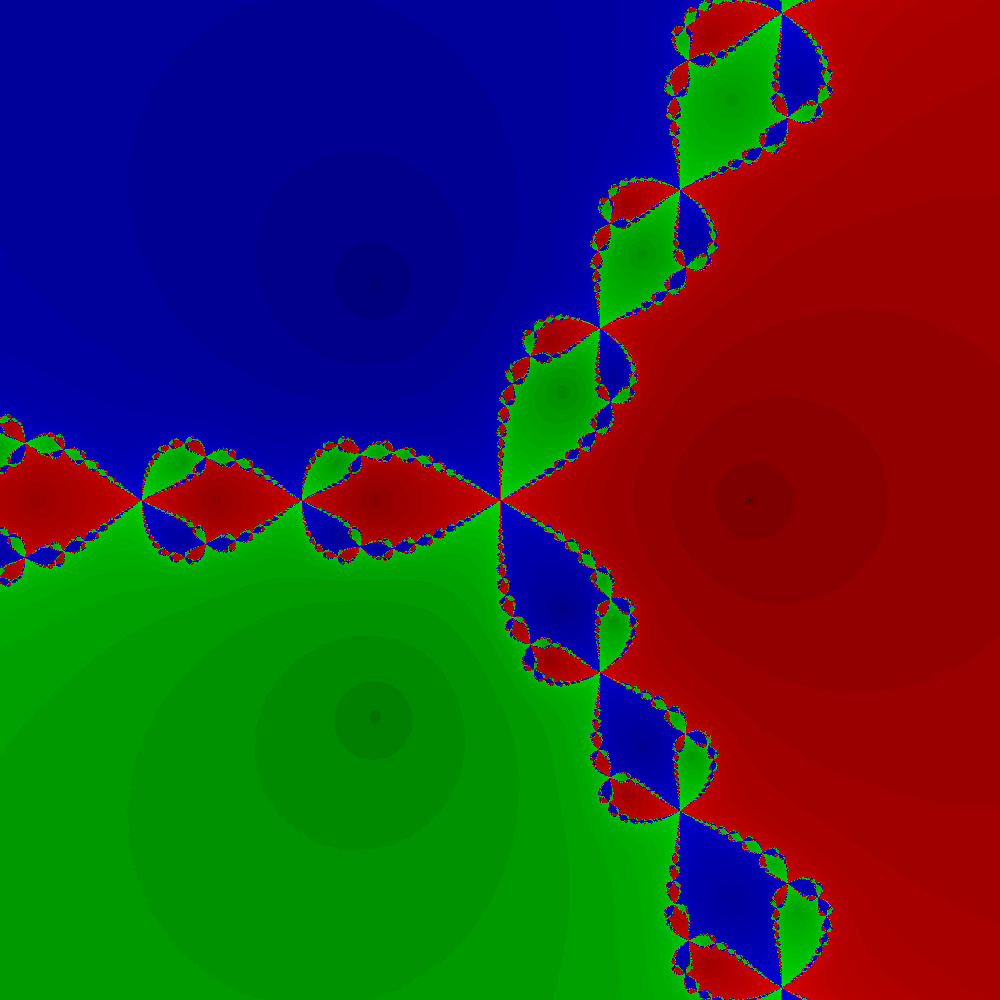
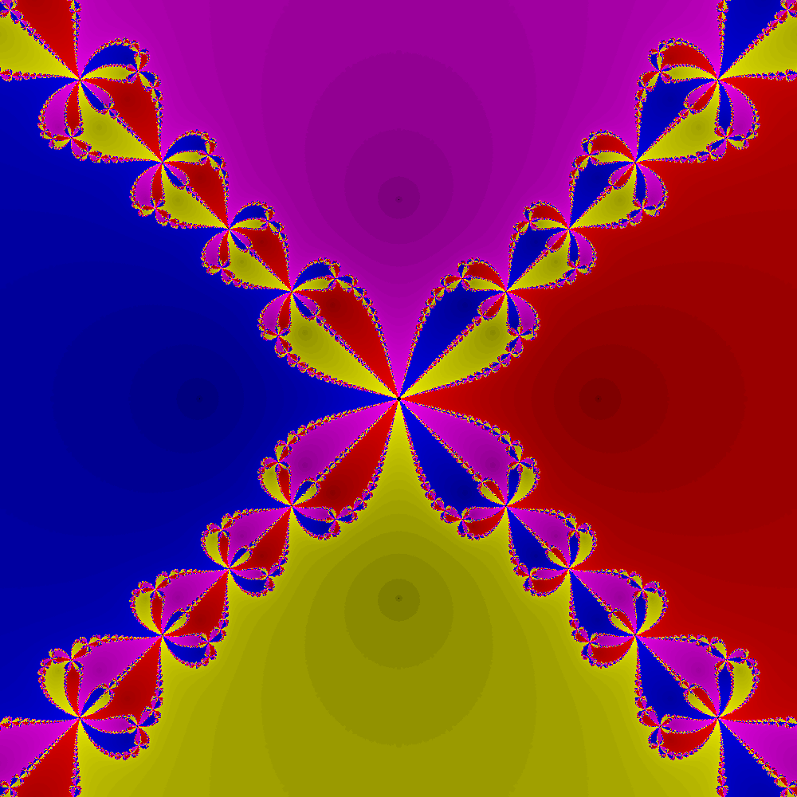
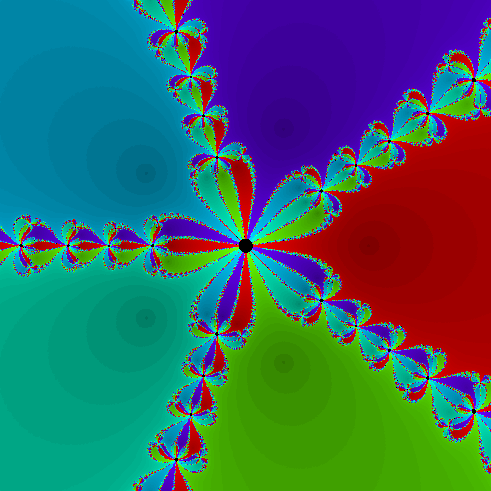

### Dependencies:
- **ISPC (Intel SPMD Program Compiler)**: Required to compile the parallel parts of the code.
- **C++ Compiler**: A C++ compiler like `g++` to compile the serial parts of the code.


### Building the Project

To compile and build the fractal generation program, follow these steps:

## 1. Generate ISPC Files
```bash
ispc fractal.ispc -o fractal_ispc.o -h fractal.h
```
This generates the ISPC object file (fractal_ispc.o) and a header file (fractal.h) for the C++ code to link with.
## 2. Compile the C++ Code
```bash
g++ -O2 main.cpp fractal_ispc.o -o fractal
```
This will generate an executable named `fractal`.
## 3. Run the Program
### Command-Line Arguments:
**n** - The number of roots for the fractal. The default is 3, but you can specify any integer value for n.
```
./fractal <n>
```
The program will generate an image and save it as `fractal.ppm`.


## Example Fractal Images
### n = 3


---

### n = 4


---

### n = 5
